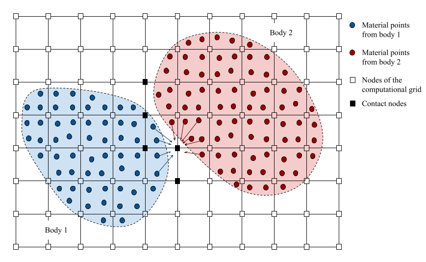
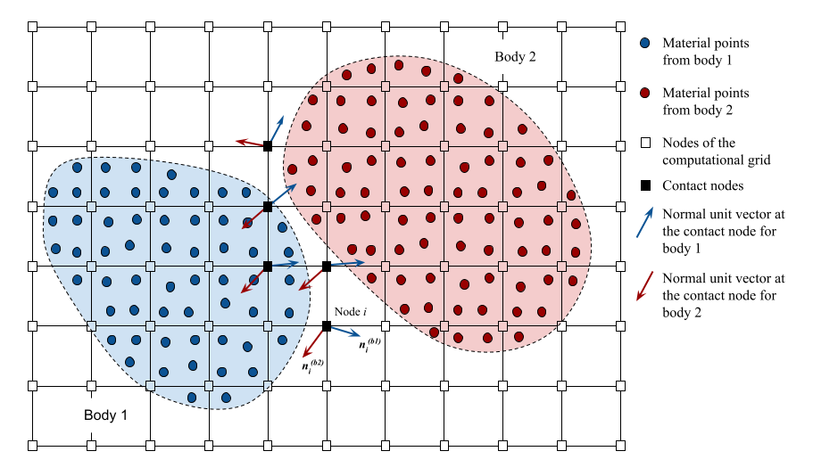
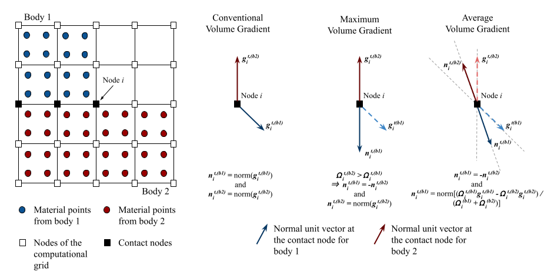

# Contact Mechanics Between Distinct Bodies

The Material Point Method is naturally capable of modeling distinct bodies because each material point holds the information of its material. However, the conventional MPM alone does not handle contact mechanics when different bodies meet. Therefore, the MPM requires a contact algorithm capable of identifying the contact between distinct bodies and applying a contact relationship. A frictional contact algorithm proposed by Bardenhagen et. al. (2000) is implemented in the CB-Geo MPM code. The approach involves prescribing a normal to the interface surface by mapping the gradient of volumes from the material points to the computational grid, identifying the normal and tangential movement to the interface, and finally correcting the velocity to avoid interpenetration of the bodies and resolve their frictional relationship. Moreover, for each distinct body, the mapped gradients of the volumes are nomalized, yielding the final normal unit vector, the mapped gradients of the volumes are normalized, yielding the final normal unit vector at the surface. However, the gradient of volumes alone usually leads to normal vectors on each body that are not aligned with each other. When this happens, the conservation of momentum is violated as the contact mechacnis is applied to contact nodes. Hence, the contact implementation allows for the use of two extensions to this normal vector computation, namely the Maximum Volume Gradient (MVG) and the Average Volume Gradient (AVG), proposed by Nairn (2013). Both approaches guarantee a colinearity between the computed normal vectors at the same node.

> Fig. 1: Contact nodes, each detected when two or more bodies map information to that given node.

> Fig. 2: Resulting normal vectors at each contact node determined by the conventional volume gradient approach. Different colors represent different bodies.

# Contact Algorithm {docsify-ignore}

> at each time step $\Delta t$ from $t$ to $t + \Delta t$, the nodal kinematics are computed similar to the conventional MPM algorithm while considering distinct materials:

## Initial Nodal Kinematics

* The state parameters at the material points are initialised at the beginning of every time step in the same manner as it is in the conventional MPM.

* The shape functions $N_i(x_p^t)$ and the gradient of the shape functions $B_i (x_p^t)$ are also computed at each material point like in conventional MPM.

* To identify a contact node, the material ids of all the material points in a cell are mapped to the associated nodes, where a list of unique material ids is maintained. Any node which has more than two material ids is identified as a contact node.

* The nodal mass and momentum are calculated separately for each body $b$ based on the mass and velocity of all the material points corresponding to the body $b$ in the cell. The properties are then mapped to the nodes using the shape functions.

    * Compute nodal mass of each body

        $$ m^{t,(b)}_{i} = \sum\limits_{p \in b} N_i(\textbf{x}_p^t) m_p $$

    * Compute nodal momentum of each momentum

        $$ (m \textbf{v})^{t,(b)}_{i} =  \sum\limits_{p \in b} N_i(\textbf{x}_p^t)m_p \textbf{v}_p^t $$

* The nodal velocities at each active node $i$ is computed for each material $b$ based on the momentum and the nodal mass.

    $$ \textbf{v}_{i}^{t,(b)} = \frac{(m \textbf{v})_{i}^{t,(b)}}{m_{i}^{t,(b)}} $$

* For the USF approach:

    * The strain at each material point is computed by mapping the strain rate from the nodes considering the material id of $p$:

        $$ \boldsymbol{\varepsilon}_p^t = \sum\limits_{i} B_i(\textbf{x}_p^t) \textbf{v}_{i}^{t,(b)} \quad \mbox{with} \quad b \ni p $$ 

    * The stress is then updated at each material point based on the constitutive model as it is for the conventional MPM with the USF approach. 

* Compute the nodal body force from the material points considering each material id separately:

    * Body force:

        $$ \textbf{b}_{i}^{t,(b)} = G \sum\limits_{p \in b} N_i(\textbf{x}_p^t) m_p $$

* Compute the nodal external and internal force considering each material id separately

    * External force:

        $$ (\textbf{f})^{ext,t,(b)}_{i} = \textbf{b}_{i}^{t,(b)} + \textbf{t}_{i}^{t,(b)} $$

    * Internal force:

        $$ (\textbf{f})^{int,t,(b)}_{i} = \sum\limits_{p \in b} V_p^t B_i(\textbf{x}_p^t) \boldsymbol{\sigma}_p^t $$

    * Resulting force:

        $$ \textbf{f}_{i}^{t,(b)} = (\textbf{f})^{ext,t,(b)}_{i} + (\textbf{f})^{int,t,(b)}_{i} $$

* The nodal acceleration and velocities of the next step $ t + \Delta t$ for each mateiral id are computed on all active nodes:

    * Nodal acceleration:

        $$ \textbf{a}_{i}^{t+\Delta t,(b)} = \frac{\textbf{f}_{i}^{t,(b)}}{m_{i}^{t,(b)}} $$

    * Nodal velocity:

        $$ \textbf{v}_{i}^{t + \Delta t,(b)} = \textbf{v}_{i}^{t,(b)} + \textbf{a}_{i}^{t + \Delta t,(b)} * \Delta t $$

## Normal Vector Computation

> at each time step $\Delta t$ from $t$ to $t + \Delta t$:

* The volume gradient is computed at each node for each separate material by mapping the gradient of the volumes at each node:

    $$ \textbf{g}_{i}^{t,(b)} = \sum\limits_{p \in b} V_p^t B_i(\textbf{x}_p^t) $$

* The domain is computed at each node for each separate material by mapping the volumes at each node:

    $$ \Omega_{i}^{t,(b)} = \sum\limits_{p\in b} V_p^t N_i(\mathbf{x}_p^t) $$

* The normal unit vector is then determined in one of the three following procedures:

    1. Pure Volume Gradient approach, as described by Bardenhagen et al. (2000). The normal unit vector is simply the normalized volume gradient vector:

    $$ \hat{n_{i}^{t,(b)}} = \frac{\textbf{g}_{i}^{t,(b)} }{|| \textbf{g}_{i}^{t,(b)}  ||} $$

    2. Maximum Volume Gradient (MVG) approach, which compares the domain of the two materials in contact. The normal unit vector is the normalized gradient vector of the body with largest domain:

    $$ \Omega_{i}^{t,(b1)} >  \Omega_{i}^{t,(b2)} \Rightarrow \hat{n}_{i}^{t,(b1)} = \frac{\textbf{g}_{i}^{t,(b1)} }{|| \textbf{g}_{i}^{t,(b1)}  ||} \quad \mbox{and} \quad \hat{n}_{i}^{t,(b2)} = -\hat{n}_{i}^{t,(b1)} = -\frac{\textbf{g}_{i}^{t,(b1)} }{|| \textbf{g}_{i}^{t,(b1)}  ||} $$

    3. Average Volume Gradient (AVG) approach, which sets the normal unit vector as the weighted average of the volume gradients with respect to the domains. The conventional normal unit vector refers to the ones determined in the first approach:

    $$ \tilde{\mathbf{g}}_{i}^{t,(b1)} = \frac{\Omega_{i}^{t,(b1)} \mathbf{g}_{i}^{t,(b1)} - \Omega_{i}^{t,(b2)} \mathbf{g}_{i}^{t,(b2)}}{\sum\limits_b \Omega_{i}^{t,(b)}} \quad \mbox{and} \quad \hat{n}_{i}^{t,(b1)} = \frac{\tilde{\mathbf{g}}_{i}^{t,(b1)}}{|| \tilde{\mathbf{g}}_{i}^{t,(b1)} ||} $$

> Fig. 3:  Graphic representation of the normal vector computation approaches in the CB-Geo MPM.

## Apply Contact Mechanics

> at each time step $\Delta t$ from $t$ to $t + \Delta t$:

* A contact node is detected by checking the size of its set of material ids; sets with more than one material is considered a contact node.

> for each contact node:

* The material's relative velocity to the velocity of the center of mass is computed at each contact node. The velocity of the center of mass is the one determined using the conventional MPM algorithm.

    $$ \Delta \textbf{v}_{i}^{t+\Delta t,(b)} = \textbf{v}_{i}^{t+\Delta t,(b)} - \textbf{v}_{i}^{t+\Delta t} $$

* The material's movement is checked at each contact node:

    $$ \Delta \textbf{v}_{i}^{t+\Delta t,(b)} \cdot \hat{n}_{i}^{t,(b)} > 0 \quad \Rightarrow \quad \mbox{approaching} $$

    $$ \Delta \textbf{v}_{i}^{t+\Delta t,(b)} \cdot \hat{n}_{i}^{t,(b)} \leq 0 \quad \Rightarrow \quad \mbox{separating} $$

* If the node is not a contact node or if the material is separating, nothing is done ($ \tilde{\textbf{v}}_{i}^{t+\Delta t,(b)} = \textbf{v}_{i}^{t+\Delta t,(b)} $). Otherwise (approaching condition):

    * The normal and tangential components of the relative velocity are computed

        $$ \Delta \textbf{v}_{i,norm}^{t+\Delta t,(b)} = [\Delta \textbf{v}_{i}^{t+\Delta t,(b)} \cdot \hat{n}_{i}^{t,(b)}] \hat{n}_{i}^{t,(b)} $$

        $$ \Delta \textbf{v}_{i,tan}^{t+\Delta t,(b)} = \hat{n}_{i}^{t,(b)} \times [\Delta \textbf{v}_{i}^{t+\Delta t,(b)} \times \hat{n}_{i}^{t,(b)}] $$

    * The following normal and tangential corrections are determined

        $$ \textbf{c}_{i,norm}^{t + \Delta t,(b)} = - \Delta \textbf{v}_{i,norm}^{t+\Delta t,(b)} $$

        $$ \textbf{c}_{i,tan}^{t + \Delta t,(b)} = - \min(\mu \Delta \textbf{v}_{i,norm}^{t+\Delta t,(b)}, \Delta \textbf{v}_{i,tan}^{t+\Delta t,(b)}) $$

    * The nodal velocity is updated

        $$ \tilde{\textbf{v}}_{i}^{t+\Delta t,(b)} = \textbf{v}_{i}^{t+\Delta t,(b)} + \textbf{c}_{i,norm}^{t + \Delta t,(b)} + \textbf{c}_{i,tan}^{t + \Delta t,(b)} $$

## Update of Material Points

> at each time step $\Delta t$ from $t$ to $t + \Delta t$:

* Apply any velocity constraints (and acceleration constraints -- when velocity is set, acceleration is set to zero) ah the material points

* Update the position of the material points based on the nodal velocity of their specific material.

    * Material point velocity:

        $$ \textbf{v}_p^{t+\Delta t} = \sum\limits_{i} N_i(\textbf{x}_p^t)\tilde{\textbf{v}}_{i}^{t+\Delta t,(b)} \quad \mbox{with} \quad b \ni p $$

    * Material point position:

        $$ \textbf{x}_p^{t+\Delta t} = \textbf{x}_p^t + \textbf{v}_p^{t+\Delta t} * \Delta t $$

## Nomenclature {docsify-ignore}

### General {docsify-ignore}

$G$   acceleration due to gravity

### Material Point {docsify-ignore}

$p$ material point index

$\textbf{a}_p^t$ acceleration of the material point $p$ at time $t$

$m_p^t$ mass of the material point $p$ at time $t$

$(m\textbf{v})_p^t$ momentum of the material point $p$ at time $t$

$\textbf{t}_p^t$ traction at material point $p$ at time $t$

$\textbf{v}_p^t$ velocity of the material point $p$ at time $t$

$V_p$ volume at material point $p$

$\textbf{x}_p^t$ coordinates of the material point $p$ at time $t$

$\boldsymbol{\varepsilon}_{p}^t$ strain tensor of the material point $p$ at time $t$

### Node {docsify-ignore}

$i$ node index

$b$ material index

$\textbf{a}_{i}^{t,(b)}$ acceleration of node $i$ and material $b$

$\textbf{b}_{i}^{t,(b)}$ body force of node $i$ and material $b$ at time $t$

$\textbf{f}_{i}^{t,(b)}$ nodal force of node $i$ and material $b$ at time $t$

$\textbf{f}_{i}^{ext,t,(b)}$ nodal external force of node $i$ and material $b$ at time $t$

$\textbf{f}_{i}^{int,t,(b)}$ nodal internal force of node $i$ and material $b$ at time $t$

$m_{i}^{t,(b)}$ mass of node $i$ and material $b$ at time $t$

$(m\textbf{v})_{i}^{t,(b)}$ momentum of node $i$ and material $b$ at time $t$

$\textbf{t}_{i}^{t,(b)}$ traction at node $i$ and material $b$ at time $t$

$\textbf{v}_{i}^{t,(b)}$ velocity of node $i$ and material $b$ at time $t$

$\boldsymbol{\sigma}_{i}^{t,(b)}$ stress tensor of node $i$ and material $b$ at time $t$

$\textbf{v}_i^t$ velocity of the center of mass at node $i$ and time $t$

$\Delta \textbf{v}_{i}^{t,(b)}$ relative velocity of node $i$ and material $b$ at time $t$

$\Delta \textbf{v}_{i,norm}^{t,(b)}$ normal component of the relative velocity of node $i$ and material $b$ at time $t$

$\Delta \textbf{v}_{i,tan}^{t,(b)}$ tangent component of the relative velocity of node $i$ and material $b$ at time $t$

$\textbf{c}_{i,norm}^{t,(b)}$ normal correction of the velocity of node $i$ and material $b$ at time $t$

$\textbf{c}_{i,tan}^{t,(b)}$ tangent correction of the velocity of node $i$ and material $b$ at time $t$

$\tilde{\textbf{v}}_{i}^{t,(b)}$ corrected velocity of node $i$ and material $b$ at time $t$

### Shape Functions

$B_i (\textbf{x}_p^t)$ gradient of the shape function that maps node $i$ to material point $p$ and vice versa such that $B = \frac{dN}{d\textbf{x}}$

$N_i (\textbf{x}_p^t)$ shape function that maps node $i$ to material point $p$ and vice versa with independent variable of the location of each material point at time $t$

[1] Bardenhagen, S.G., Brackbill, J. U., Sulsky, D. (2000). The material-point method for granular materials. Computer Methods in Applied Mechanics and Engineering, 187(3-4), 529-541.

[2] Nairn, J. A. (2013). Modeling imperfect interfaces in the material point method using multimaterial methods. Computer Modeling in Engineering and Sciences, 1(1), 1-15.