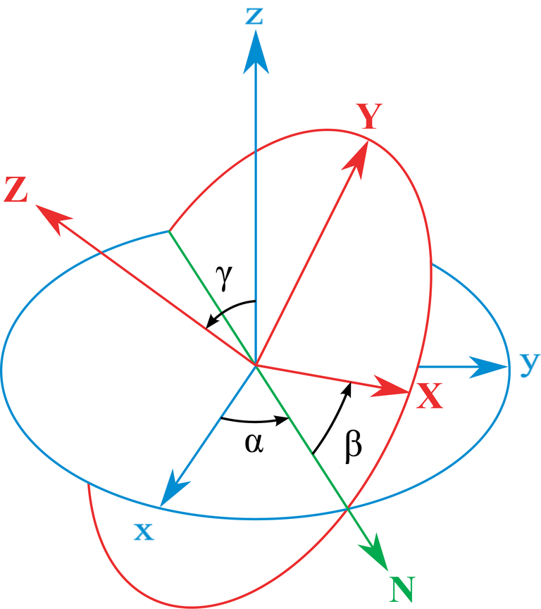

# Rotation matrix

Any three-dimensional coordinate system (including conventional Cartesian axes x, y and z) can be rotated to another three-dimensional coordinate system as long as they maintain the orthogonality among the axes. In linear algebra, this is called the change of basis. 

Thus any property described as a vector in three-dimensional axes could be rotated to a new set of axes [1]:

$$ \hat{\mathbf{u}} = \mathbf{R}^{-1} \mathbf{u} $$

where $\hat{\mathbf{u}}$ is the property vector (for example velocity or acceleration) in a rotated coordinate system, $\mathbf{R}$ is the rotation matrix, and $\mathbf{u}$ is the property vector in the original coordinate system.

> Euler angles geometrical definition used in the code [2].

The lower case $x, y, z$ is the original coordinate system, while the upper case $X, Y, Z$ is the rotated coordinate system. The upper case $N$ is the line of nodes, defined as the line that bisects $x$ and $y$ in the original coordinate system. The angles shown are defined anti-clockwise from the original coordinate system. Note that all angles in the code are in radians, not degrees. Also $\gamma = 0$ in two-dimensional case and the implementation omits this extra variable. 

The rotation matrix, $\mathbf{R}$ is:

$$
\mathbf{R} = \left[\begin{matrix} \cos{\alpha} \cos{\beta} - \sin{\alpha} \cos{\gamma} \sin{\beta} & - \cos{\alpha} \sin{\beta} - \sin{\alpha} \cos{\gamma} \cos{\beta} & \sin{\gamma} \sin{\alpha} \\\\ \sin{\alpha} \cos{\beta} + \cos{\alpha} \cos{\gamma} \sin{\beta} &  - \sin{\alpha} \sin{\beta} + \cos{\alpha} \cos{\gamma} \cos{\beta} & - \sin{\gamma} \cos{\alpha} \\\\ \sin{\gamma} \sin{\beta} & \sin{\gamma} \cos{\beta} & \cos{\gamma} \end{matrix}\right]
$$

In two-dimensions, the rotation matrix reduces to:

$$
\mathbf{R} = \left[\begin{matrix} \cos{\alpha} \cos{\beta} - \sin{\alpha} \sin{\beta} & - \cos{\alpha} \sin{\beta} - \sin{\alpha} \cos{\beta} \\\\ \sin{\alpha} \cos{\beta} + \cos{\alpha} \sin{\beta} & - \sin{\alpha} \sin{\beta} + \cos{\alpha} \cos{\beta} \end{matrix}\right]
$$

## Reference {docsify-ignore}

[1] https://en.wikipedia.org/wiki/Rotation_matrix

[2] https://en.wikipedia.org/wiki/Euler_angles

