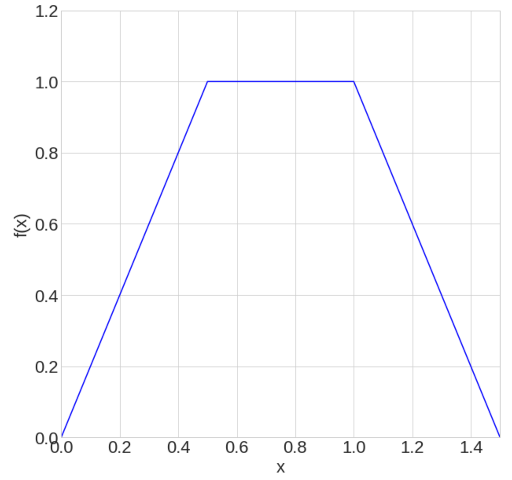

# Preprocessing

## Input JSON
The CB-Geo MPM code uses a `JSON` file for input configuration.

```JSON
{
  "title": "Example JSON Input for 3D MPM",
  "mesh": {
    "mesh": "mesh-3d.txt",
    "entity_sets": "entity_sets.json",
    "boundary_conditions": {
        "velocity_constraints": [
            {
                "nset_id" : 0,
                "dir": 0,
                "velocity": 0.00
            },
            {
                "nset_id" : 1,
                "dir": 1,
                "velocity": 0.00
            }
        ],
        "friction_constraints": [
            {
                "nset_id" : 1,
                "dir": 1,
                "sign_n": -1,
                "friction": 0.5
            }
        ],
        "nodal_euler_angles": "nodal-euler-angles.txt"
    },
    "particles_volumes": "particles-volumes.txt",
    "particles_stresses": "particles-stresses.txt",
    "particles_cells": "particles-cells.txt",
    "isoparametric": false,
    "check_duplicates": false,
    "cell_type": "ED3H8",
    "io_type": "Ascii3D",
    "node_type": "N3D"
  },
  "particles": [
    {
      "generator": {
        "check_duplicates": true,
        "location": "particles.txt",
        "io_type": "Ascii2D",
        "particle_type": "P2D",
        "material_id": 1,
        "type": "file"
      },
      "set_id": 0
    },
    {
      "generator": {
        "check_duplicates": true,
        "cset_id": -1,
        "particle_type": "P2D",
        "material_id": 1,
        "nparticles_per_dir": 2,
        "type": "gauss"
      },
      "set_id": 1
    }
  ],
  "materials": [
    {
      "id": 0,
      "density": 1000.0,
      "poisson_ratio": 0.495,
      "type": "LinearElastic3D",
      "youngs_modulus": 1.0E+08
    },
    {
      "id": 1,
      "density": 2300.0,
      "poisson_ratio": 0.25,
      "type": "LinearElastic3D",
      "youngs_modulus": 1.5E+06
    }
  ],
  "external_loading_conditions": {
    "concentrated_nodal_forces": [
      {
        "nset_id": 0,
        "math_function_id": 0,
        "dir": 1,
        "force": 10.5
      }
    ],
    "gravity": [0.0, -9.81],
    "particle_surface_traction": [
      {
        "pset_id": 1,
        "dir": 1,
        "math_function_id": 0,
        "traction": 10.5
      }
    ]
  },
  "math_functions": [
    {
      "id": 0,
      "type": "Linear",
      "xvalues": [0.0, 0.5, 1.0],
      "fxvalues": [0.0, 1.0, 1.0],
    }
  ],
  "analysis": {
    "type": "MPMExplicit3D",
    "stress_update": "usf",
    "velocity_update": true,
    "dt": 1.0E-5,
    "damping": {
      "type": "Cundall",
      "damping_ratio": 0.05
    },
    "uuid": "usf-axial-loading-5cb93af",
    "nsteps": 10,
    "resume": {
      "resume": true,
      "uuid": "usf-axial-loading-5cb93af",
      "step": 5
    },
    "pressure_smoothing" : false
  },
  "post_processing": {
    "output_steps": 5,
    "vtk": ["stresses", "strains", "velocities"],
    "vtk_statevars": ["pdstrain"],
    "path": "results/"
  }
}
```

## Mesh

The `mesh` object define the mesh (node and cells) and boundary conditions. The option `isoparametric` is used for unstructured (non-prismatic) elements. The element type is defined using `cell_type`. 
```
  "mesh": {
    "mesh": "mesh-3d.txt",
    "entity_sets": "entity_sets.json",
    "boundary_conditions": {
       "velocity_constraints": "velocity-constraints.txt"
    },
    "particles_volumes": "particles-volumes.txt",
    "particles_stresses": "particles-stresses.txt",
    "particles_cells": "particles-cells.txt",
    "isoparametric": false,
    "check_duplicates": false,
    "cell_type": "ED3H8",
    "io_type": "Ascii3D",
    "node_type": "N3D"
  }
```

|Cell type				| Description				|
|---------------------------------------|---------------------------------------|
|ED2T2					| 2D Triangle 3-noded element		|
|ED2T6					| 2D Triangle 3-noded element		|
|ED2Q4					| 2D Quadrilateral 4-noded element	|
|ED2Q8					| 2D Quadrilateral 8-noded element	|
|ED2Q9					| 2D Quadrilateral 9-noded element	|
|ED2Q16G				| 2D GIMP Quadrilateral 4-noded element |
|ED3H8					| 3D Hexahedron 8-noded element	|
|ED3H20				| 3D Hexahedron 20-noded element	|
|ED3H64				| 3D GIMP Hexahedron 64-noded element	|

> Input files

|File					| Description				|
|---------------------------------------|---------------------------------------|
|mesh					| Nodal coordinates and cell node ids	|
|velocity_constraints (optional) 	| Velocity constraints on the nodes	|
|particles_volumes (optional) 		| Particle volumes			|
|particles_tractions (optional) 	| Traction applied on the particles	|
|particles_stresses (optional) 	| Initial stresses of the particles	|
|particles_cells (optional) 		| Initial guess of particle location	|
|entity_sets (optional)                 | Sets of particles or sets of nodes    |

## Particles

The `particles` object defines the type of particles, and the material of each particle. If these particles are divided into sets, then the materials must also be assigned to the sets separately by associating a vector of set ids to a material id as indicated below within `entity_sets`. Particles can be generated from a file or at Gauss points in a cell. To read particles from a file choose type as `file`. To generate at Gauss points use `gauss`. With Gauss point generator, the number of partices in each direction is specified using `nparticles_per_dir` option. Particles can be generated only in a selected subset of cells using the `cset_id`, which is a cell set defined in `entity_sets`. A `cset_id` of `-1` will generate particles in all the cells.

```
  "particles": [
    {
      "generator": {
        "check_duplicates": true,
        "location": "particles.txt",
        "io_type": "Ascii2D",
        "particle_type": "P2D",
        "material_id": 1,
        "type": "file"
      },
      "set_id": 0
    },
    {
      "generator": {
        "check_duplicates": true,
        "cset_id": -1,
        "particle_type": "P2D",
        "material_id": 1,
        "nparticles_per_dir": 2,
        "type": "gauss"
      },
      "set_id": 1
    }
  ]
```

An initial `material_id` must still be assigned outside of `particle_sets`.

## Analysis

The `analysis` object defines the type of analysis, number of steps, time-step, and an optional resume support.

```
  "analysis": {
    "type": "MPMExplicit3D",
    "stress_update": "usf",
    "velocity_update", true,
    "dt": 1.0E-5,
    "nsteps": 10,
    "uuid": "usf-axial-loading-5cb93af",
    "resume" : {
      "resume": true,
      "uuid": "usf-axial-loading-5cb93af",
      "step" : 5
    }
  }
```

The CB-Geo MPM currently supports 2D and 3D explicit analysis. An analysis option can be selected by passing a required `-a` command to the mpm executable.

Supported analyses are:

|Analysis       | Description   	|
|---------------|-----------------------|
|MPMExplicit2D	| Explicit 2D MPM	|
|MPMExplicit3D	| Explicit 3D MPM	|

Stress update defines the type of stress update used in the algorithm: "usf", "usl" and "musl". If no method is specified, Update Stress First ("usf") will be used as default.

|Stress update  | Description 			|
|---------------|-------------------------------|
|usf            | Update Stress First   	|
|usl            | Update Stress Last   	|
|musl           | Modified Update Stress Last   |

### Velocity update [optional]

In explicit code, the `velocity_update` flag allows to switch between updating particle velocity based on nodal acceleration (default, when `velocity_update` is set to `false`) and to use nodal velocity when set to `true`.

### Resume [optional]

The CB-Geo mpm code allows for an optional resume at a check-point support. To resume an analysis at a give time-step, please set the option `resume` to `true`, the analysis `uuid` to which to resume from has to be assigned, and the `step` from which to resume. 


### Damping [optional]

Cundall damping can be specified in the analysis option. A 5% damping is applied to the analysis using the following configuration:

```
    "damping": {
      "type": "Cundall",
      "damping_ratio": 0.05
    },
```

## Loading

The `external_loading_condition` loading specifies gravity, concentrate nodal forces and particle tractions. 

```
  "external_loading_conditions": {
    "concentrated_nodal_forces": [
      {
        "nset_id": 0,
        "math_function_id": 0,
        "dir": 1,
        "force": 10.5
      }
    ],
    "gravity": [0.0, -9.81],
    "particle_surface_traction": [
      {
        "pset_id": 1,
        "dir": 1,
        "math_function_id": 0,
        "traction": 10.5
      }
    ]
  }
```

A load without a math function will be applied as a static load. Use math functions for time-varying loads.

Both `concentrated_nodal_forces` and `particle_surfacce_traction` use [`entity_sets`](./entity_sets) to apply forces on a set of nodes and particles. The loading can be time-varying. The time-variation of the load can be specified using a math function. Setting the `nset_id` or `pset_id` to `-1` will apply the loading to all the nodes and particles. 

### Math functions

Math functions are useful to define how a certain load varies with time. A typical math function is shown below.

```
  "math_functions": [
    {
      "id": 0,
      "type": "Linear",
      "xvalues": [0.0, 0.5, 1.0, 1.5],
      "fxvalues": [0.0, 1.0, 1.0, 0.0],
    }
  ]
```

This is a linear function with x and corresponding f(x) values. The function varies as shown in the figure. If used with a traction, the value of traction at different times will be computed as the defined math function.




### ASCII loading conditions
> Warning: ASCII loading conditions do not support math functions

Loading conditions on the nodes can also be specified through an ASCII file. The JSON configuration for the boundary
condition is:

```
    "external_loading_conditions": {
        "concentrated_nodal_forces": {
               "file": "nodal-tractions.txt"
        }
    }
```

#### Concentrated nodal forces

Concentrated nodal forces can be specified in the following format:

```
n_0     d_0     f_0
n_1     d_1     f_1
...
...
n_i     d_i     f_i
...
...
n_n     d_n     f_n
```

where, 

`n_i` is the node number.

`d_i` is the direction number `(0|1|2)` that corresponds to a cartesian direction, typically `(x|y|z)`.

`f_i` is the force at node `n_i` in direction `d_i`.


## Boundary conditions

Velocity and friction constraints can be specified on the nodes. Velocity constraints can also be specified on particles as well. The `nodal_euler_angles` are used for non-cartesian boundaries.

```
    "boundary_conditions": {
        "velocity_constraints": [
            {
                "nset_id" : 0,
                "dir": 0,
                "velocity": 0.00
            },
            {
                "nset_id" : 1,
                "dir": 1,
                "velocity": 0.00
            }
        ],
        "friction_constraints": [
            {
                "nset_id" : 1,
                "dir": 1,
                "sign_n": -1,
                "friction": 0.5
            }
        ],
        "nodal_euler_angles": "nodal-euler-angles.txt",
        "particle_velocity_constraints": [
            {
                "pset_id" : 0,
                "dir": 0,
                "velocity": 0.00
            }
        ],
    },
```

### Ascii boundary conditions
> Warning: ASCII boundary conditions do not support math functions

Boundary conditions on the nodes can be specified through as ASCII file. The JSON configuration for the boundary
condition is:

```
    "boundary_conditions": {
        "velocity_constraints": [
            {
                "file" : "velocity-constraints.txt"
            }
        ],
        "friction_constraints": [
            {
                "file" : "friction-constraints.txt"
            }
        ],
    },
    "external_loading_conditions": {
        "concentrated_nodal_forces": {
               "file": "nodal-tractions.txt"
        }
    }
```

#### Velocity constraints

Velocity constraints at each node can be specified in the following format:

```
n_0     d_0     v_0
n_1     d_1     v_1
...
...
n_i     d_i     v_i
...
...
n_n     d_n     v_n
```

where, 

`n_i` is the node number.

`d_i` is the direction number `(0|1|2)` that corresponds to a cartesian direction, typically `(x|y|z)`.

`v_i` is the specified velocity in direction `d_i`.


#### Friction constraints

Friction constraints at each node can be specified in the following format:

```
n_0     d_0	s_0	f_0
n_1     d_1     s_1	f_1
...
...
n_i     d_i     s_i	f_i
...
...
n_n     d_n     s_n	f_n
```

where, 

`n_i` is the node number.

`d_i` is the direction number `(0|1|2)` that corresponds to a cartesian direction, typically `(x|y|z)`.

`s_i` is the sign of the normal vector to the plane where friction is acting (+1/-1)

`f_i` is the friction coefficient.

