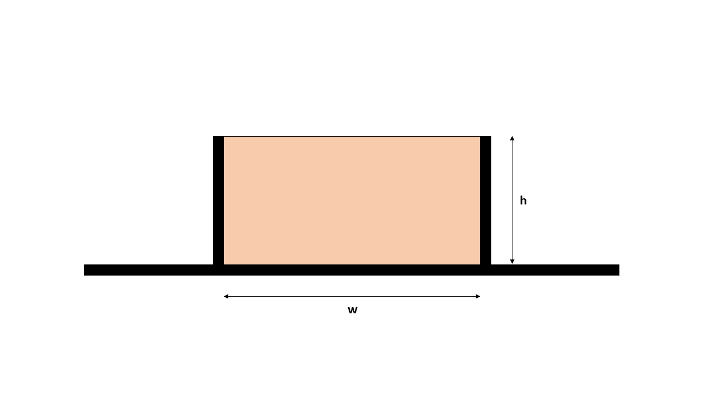

# Hydrostatic Column

## Hydrostatic Analytical Solution

The hydrostatic validation involves applying gravity loading to a column of fluid restrained in both lateral directions and along the bottom plane. The Newtonian fluid model will yield hydrostatic pressures for all normal stress directions ($\sigma_{xx}$, $\sigma_{yy}$, $\sigma_{zz}$).

*Hydrostatic column with a width `w` of 0.2 m and height `h` of 0.1 m. Restrained in both the lateral directions and along the bottom plane*

## MPM configuration

### Mesh

|Cell dimensions	| value		|
|-----------------------|---------------|
|x-length 		| 0.01 $m$ 	|
|y-length 		| 0.01 $m$ 	|

### Particles

|Particle spacings	| value		|
|-----------------------|---------------|
|x-spacing 		| 0.002 $m$ 	|
|y-spacing 		| 0.002 $m$ 	|
|Particles per cell |  25  |

### Analysis

|Description		| value		|
|-----------------------|---------------|
|Total analysis time 	| 0.1 s		|
|dt                     | 0.00001 s |
|Gravity		| -9.81 $m/s^2$		|

### Material

|Description		| value		|
|-----------------------|---------------|
|Material	                          | Newtonian |
|Density ($\rho$) 		              | 1800.0 $kg/m^3$ |
|Young's modulus ($E$)	              | 1000000 $N/m^2$	|
|Viscosity ($\mu$)                    |  0.0     |

## Hydrostatic Analysis

Analysis are carried out using MPM Explicit USF and USL algorithms.

## Results

### USF Results at 0.1s

| Parameter				| Analytical	| Velocity Update	| Acceleration Update 	|
|---------------------------------------|---------------|---------------|---------------|
|$\sigma_{yy} (N/m^2)$			| -1730.484		| -1680.244	|  |
|$\sigma_{xx} (N/m^2)$          | -1730.484		| -1680.244	|  |

### USL Results at 0.1s

| Parameter				| Analytical	| Velocity Update	| Acceleration Update 	|
|---------------------------------------|---------------|---------------|---------------|
|$\sigma_{yy} (N/m^2)$			| -1730.484		| -1680.182	|   |
|$\sigma_{xx} (N/m^2)$          | -1730.484		| -1680.182	| 	|

