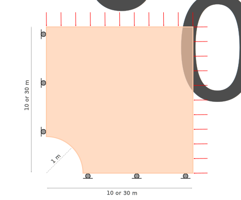
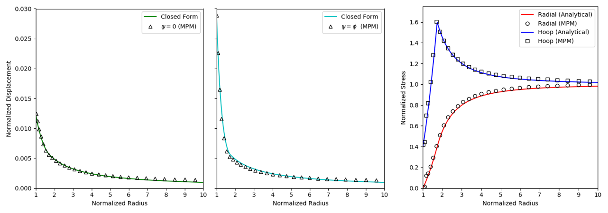
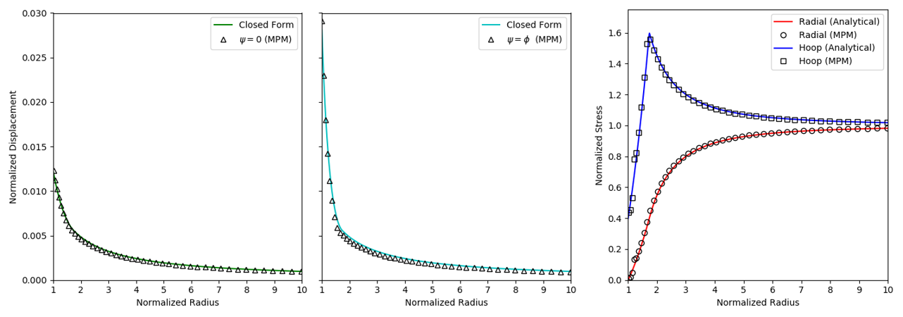

# Cylindrical Hole in an Infinite Mohr-Coulomb Medium

A square plate is modeled twice in the plane strain condition using quarter-symmetry. The first plate has length and width of 10 m and the second plate has length and width of 30 m. A quarter circle of radius 1 m is removed from the bottom left corner of both plates. Boundary conditions including fixed boundaries and external loads are described in Figure 1. External pressure is $P_0$ = -30 MPa. Additionally, the plate is subjected to an insitu stress of $P_0$ = -30 MPa (compression negative).

> Figure 1: Load and boundary conditions for 10 m and 30 m models

## Analytical Solution

The closed form solution for this problem is from Salencon [1]. The normalized form of the analytical solution is from [2]. 

### Elastic-plastic boundary

The yield zone radius ($R_0$) is

$$\frac{R_0}{a} = \left(\frac{2}{K_p+1}\frac{1+\frac{q}{P_0}k_p}{\frac{P_i}{P_0}+\frac{q}{P_0}k_p}\right)^{k_p}$$

where $a$ is hole radius, $P_0$ is *absolute value* of insitu stress, $P_i$ is pressure within the hole, and

$$K_p = \frac{1+\sin\phi}{1-\sin\phi}$$

$$k_p = \frac{1}{K_p-1}$$

$$q = 2c\sqrt{K_p}$$

Radial stress at the elastic-plastic interface ($\sigma_{re}$) is

$$\frac{\sigma_{re}}{P_0} = \frac{-1}{K_p+1}\Big(2-\frac{q}{P_0}\Big)$$

### Elastic

Radial stress ($\sigma_{rr}$), hoop stress ($\sigma_{\theta\theta}$), and radial displacement ($u_r$) in the elastic zone are

$$\frac{\sigma_{rr}}{P_0} =-1+\Big(1-\frac{\sigma_{re}}{P_0}\Big)\Big(\frac{R_0}{a}\frac{a}{r}\Big)^2$$

$$\frac{\sigma_{\theta\theta}}{P_0} = \frac{-\sigma_{rr}}{P_0}-2$$

$$\frac{u_r}{a}=\frac{-P_0}{2G} \Big(1+\frac{\sigma_{re}}{P_0}\Big)\Big(\frac{R_0}{a}\Big)^2\Big(\frac{a}{r}\Big)$$

where $G$ is shear modulus and $r$ is radial distance from the quarter-circle axis.

### Plastic

$\sigma_{rr}$, $\sigma_{\theta\theta}$, and $u_r$ in the plastic zone are

$$\frac{\sigma_{rr}}{P_0}=\frac{q}{P_0}k_p-\Big(\frac{P_i}{P_0}+\frac{q}{P_0}k_p\Big)\Big(\frac{r}{a}\Big)^{K_p-1}$$

$$\frac{\sigma_{\theta\theta}}{P_0}=\frac{q}{P_0}k_p-K_p\Big(\frac{P_i}{P_0}+\frac{q}{P_0}k_p\Big)\Big(\frac{r}{a}\Big)^{K_p-1}$$

$$\frac{u_r}{a}=\frac{-P_0}{2G}\frac{r}{a}\chi\Big(\frac{r}{a}\Big)$$

with

$$\chi\Big(\frac{r}{a}\Big)=\alpha+\beta+\gamma$$

$$\alpha=(2\nu-1)(1+\frac{q}{P_0}k_p)$$

$$\beta=\frac{(1-\nu)(K_p^2-1)}{K_p+K_{ps}}\Big(\frac{P_i}{P_0}+\frac{q}{P_0}k_p\Big)\Big(\frac{R_0}{a}\Big)^{K_p+K_{ps}}\Big(\frac{r}{R_0}\Big)^{-K_{ps}-1}$$

$$\gamma=\Big[(1-\nu)\frac{K_pK_{ps}+1}{K_p+K_{ps}}-\nu\Big]\Big(\frac{P_i}{P_0}+\frac{q}{P_0}k_p\Big)\Big(\frac{r}{a}\Big)^{K_p-1}$$

$$K_{ps} = \frac{1+\sin\psi}{1-\sin\psi}$$

where $\nu$ is Poisson's ratio and $\psi$ is dilation angle.

## Axisymmetric stresses
Comparison between the analytic and numeric solutions considers axisymmetric stresses. Radial and hoop stresses are calculated from Cartesian stresses using

$$\sigma_{rr}=\sigma_{xx}\cos^2\theta+\sigma_{yy}\sin^2\theta+\sigma_{xy}\sin{2\theta}$$

$$\sigma_{\theta\theta}=\sigma_{xx}\sin^2\theta+\sigma_{yy}\cos^2\theta-\sigma_{xy}\sin{2\theta}$$

where $\theta=\tan^{-1}\left(x/y\right)$ for the position ($x$,$y$) of material points [3].

## MPM configuration

### Analysis

|Description		| 10 m & 30 m	|
|-------------------|---------------|
|Type		 		| Explicit USF	|
|Isoparametric		| true			|
|Velocity update	| true			|
|Total steps 		| 2.0E+5		|
|dt		 			| 1.0E-6		|
|Gravity			| false			|

### Mesh

|Mesh					| 10 m			| 30 m		|
|-----------------------|---------------|-----------|
|1/4-circle elements	| 30 			| 30 		|
|radial elements  		| 30 			| 90		|

### Particles

|Particles				| 10 m			| 30 m		|
|-----------------------|---------------|-----------|
|Total particles 		| 8.1E+3		| 2.43E+4	|
|# material points /cell| 9				|9			| 

### Material

|Description				| 10 m & 30 m		|
|---------------------------|-------------------|
|Material	 				| Mohr-Coulomb		|
|Density 					| 2.5E+3 $kg/m^3$	|
|Shear modulus ($G$)		| 2.8E+9 $N/m^2$	|
|Bulk modulus ($K$)			| 3.9E+9 $N/m^2$	|
|Cohesion ($c$)				| 3.45E+6 $N/m^2$	|
|Friction angle ($\phi$)	| 30$^{\circ}$		|
|Dilation angle ($\psi$)	| 0$^{\circ}$ & 30$^{\circ}$ |

## Results

MPM Explicit USF approach with velocity update is performed.

### 10 m boundary conditions

Figure 2 shows the normalized displacement ($u_r/a$), normalized radial stress ($\sigma_{rr}/P_0$), and normalized hoop stress ($\sigma_{\theta\theta}/P_0$) vs. normalized radius ($r/a$) for the $\psi=0$ and $\psi=\phi$ scenarios using the 10 m model. Stress calculations do not differ between $\psi=0$ and $\psi=\phi$ scenarios. 

> Figure 2: Displacement for $\psi=0$, displacement for $\psi=\phi$, radial and hoop stress

### 30 m boundary conditions

Figure 3 shows the normalized displacement ($u_r/a$), normalized radial stress ($\sigma_{rr}/P_0$), and normalized hoop stress ($\sigma_{\theta\theta}/P_0$) vs. normalized radius ($r/a$) for the $\psi=0$ and $\psi=\phi$ scenarios using the 30 m model. Stress calculations do not differ between $\psi=0$ and $\psi=\phi$ scenarios. 

> Figure 3: Displacement for $\psi=0$, displacement for $\psi=\phi$, radial and hoop stress

## References
[1] Salencon, J., 1969, Contraction Quasi-Statique D'une Cavite a Symetrie Spherique Ou Cylindrique Dans Un Milieu Elasto-Plastique, Annales Des Ports et Chaussees, Vol. 4, 231-236.

[2] Itasca, 2019, Cylindrical Hole in an Infinite Mohr-Coulomb Material, PFC 6.0 documentation, [Itasca Verification Problems](http://docs.itascacg.com/pfc600/flac3d/zone/test3d/VerificationProblems/CylinderInMohrCoulomb/salencon.html).

[3] Kelly, P., 2013, Solid mechanics part II: engineering solid mechanics - small strain, Solid mechanics lecture notes, University of Auckland, 60-65.