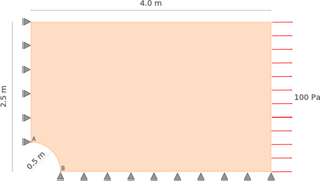
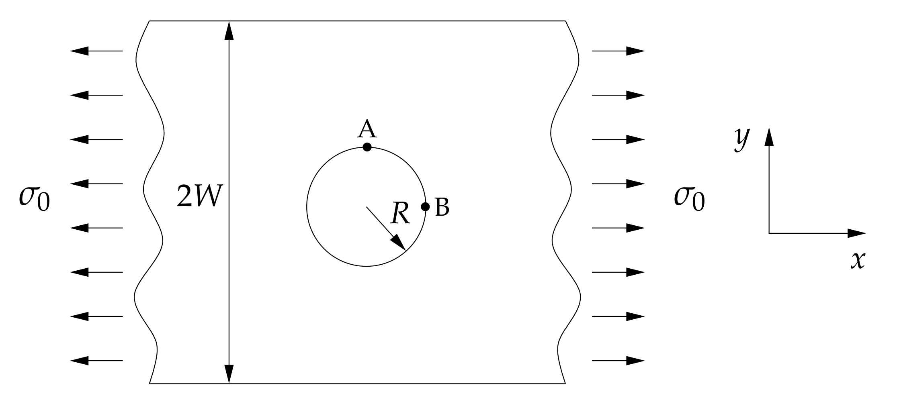
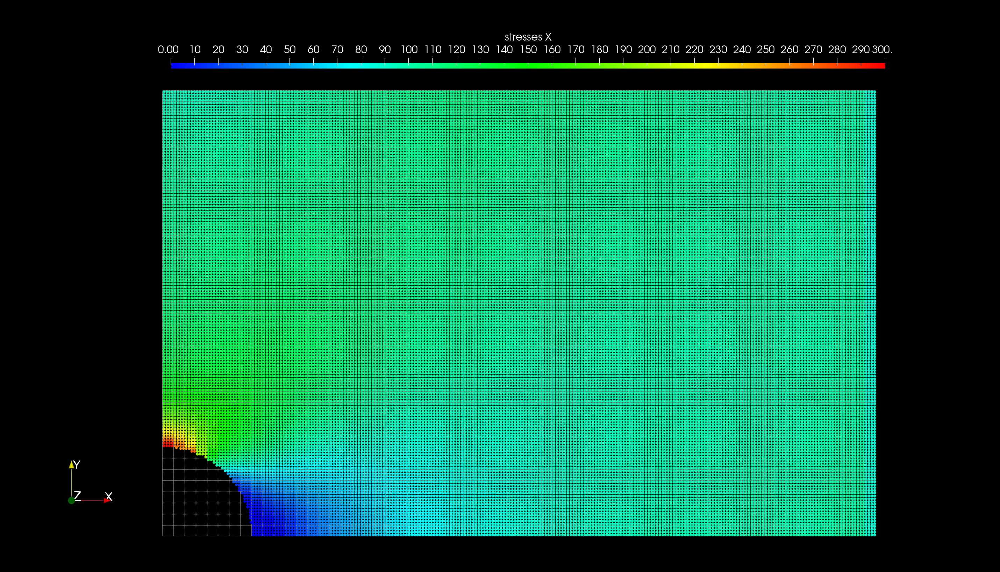
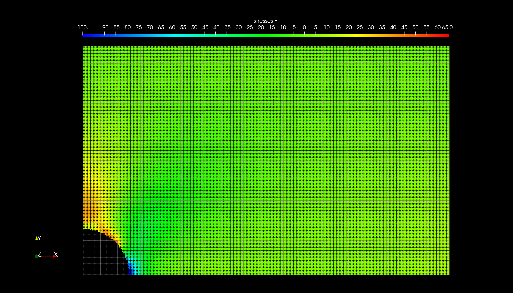

# Stress concentration around a hole

A plane strip (plane stress) of width 5 m, length 8 m with a centred hole of radius 0.5m is subjected to uniform tension of $\sigma_0$ = 100 Pa applied at the ends of the strip. Due to symmetry, a quarter of this plate is modelled.

## Linear elastic solution for stress concentration
The elastic stress concentration around a hole in an infinite plate under uniaxial tension was first described by Ernst Gustav Kirsch [1]. The Kirch equations are 

$\sigma_{rr}=\frac{\sigma_0}{2}(1-(\frac{a}{r})^2)+\frac{\sigma_0}{2}(1-4(\frac{a}{r})^2+3(\frac{a}{r})^4)cos2\theta$

$\sigma_{\theta\theta}=\frac{\sigma_0}{2}(1+(\frac{a}{r})^2)-\frac{\sigma_0}{2}(1+3(\frac{a}{r})^4)cos2\theta$

$\tau_{r\theta}=-\frac{\sigma_0}{2}(1+2(\frac{a}{r})^2-3(\frac{a}{r}^4))sin2\theta$

where _a_ is hole radius, _r_ and $\theta$ are radial coordinates and $\sigma_0$ is remote stress. The stress concentration factor, $K_t$ which is defined as the ratio of the maximum stress, $\sigma_{max}$ at hole to the remote stress, $\sigma_0$ for the infinite width plate is 3.

For a finite width plate (see Fig. 2), the elastic stress state depends on the plate width (W) and the hole radius (R). The elastic stress state of a finite width plate with a circular hole is found by empirical relationships.

We use the relationship proposed by Howland [2] to compute the elastic stress at the circular hole as shown in Fig. 1.  The stress ratios for a range of geometries (hole radius, _R_ and plate finite width, _2W_) are calculated in the table below. 

> Howland's semi-analytical solution

> Table 1: Howland's semi-analytical solution

|R/W		 | Point A $\sigma_{xx}/\sigma_0$	| Point B $\sigma_{yy}/\sigma_0$|
|----------------|--------------------------------------|-------------------------------|
|0		 | 3.00					| -1.00				|
|0.1		 | 3.03					| -1.03				|
|**0.2**	 | **3.14**				| **-1.11**			|
|0.3		 | 3.36					| -1.26				|
|0.4		 | 3.74					| -1.44				|
|0.5		 | 4.32					| -1.58				|

## MPM configuration

### Analysis

|Description		| value		|
|-----------------------|---------------|
|Type		 	| Explicit USF	|
|Velocity update	| true		|
|Total analysis time 	| 30 s		|
|dt		 	| 1.0E-4	|
|Gravity		| false		|

### Mesh

|Cell dimensions	| value		|
|-----------------------|---------------|
|x-length 		| 0.0625 $m$ 	|
|y-length 		| 0.0625 $m$ 	|

### Particles

|Particle spacings	| value		|
|-----------------------|---------------|
|x-spacing 		| 0.015625 $m$ 	|
|y-spacing 		| 0.015625 $m$ 	|
|# material points /cell| 16		| 

### Material

|Description		| value		|
|-----------------------|---------------|
|Material	 	| Linear Elastic|
|Young's modulus ($E$)	| 1.0E+6 $N/m^2$|
|Poisson ratio ($\nu$)	| 0.0		|
|Density ($kg/m^3$)	| 2000.0	|

## Results

MPM Explicit USF approach with velocity update is performed.

| Stress concentration factors		| Howland's	| MPM USF	|
|---------------------------------------|---------------|---------------|
| Point A ($\sigma_{xx}/\sigma_0$)	|  3.14		|  3.13		|
| Point B ($\sigma_{xx}/\sigma_0$)	|  0.00		| -0.029	|
| Point B ($\sigma_{yy}/\sigma_0$)	| -1.11		| -1.08		|

The stresses obtained from the Explicit Update Stress First simulation is shown below.

> Stress-XX

> Stress-YY

[1] Kirsch, 1989, Die Theorie der Elastizität und die Bedürfnisse der Festigkeitslehre. Zeitschrift des Vereines deutscher Ingenieure, 42, 797-807

[2] Howland, R.C.J., 1930, On the Stresses in the Neighborhood of a Circular Hole in a Strip under Tension*, Trans. Roy. Soc London, Series A, vol.229, 49-59
