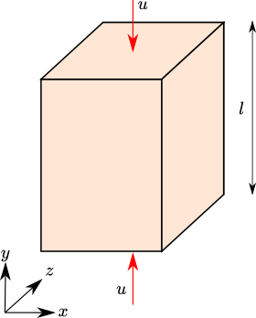

# Uniaxial stress

In an uniaxial stress state, only the axial stress is non-zero while all other stress
components are zero.

Under an axial loading condition, the strains for an isotropic linear elastic material are:

$$ \epsilon_{axial} = \frac{1}{E}(\sigma_{axial} - 2 \nu \sigma_{lateral})$$

$$ \epsilon_{lateral} = \frac{1}{E}\left[(1 - \nu)(\sigma_{lateral} - \nu \sigma_{axial} \right]$$

For an uniaxial stress ($\sigma_{lateral} = 0 $), the above equation becomes:

$$ \sigma_{axial} = E \epsilon_{axial} $$

$$ \epsilon_{lateral} = - \nu \epsilon_{axial} $$

## Analytical solution

Fo an axial loading condition, the axial strain and stress at a given time $t$ are:

$$ \epsilon_{yy} = u \times \frac{(t - t_0)}{l} $$

$$ \sigma_{yy} = E \epsilon_{yy} = E \times u \times \frac{(t - t_0)}{l} $$

and the lateral strains are:

$$ \epsilon_{xx} = \epsilon_{zz} = -\nu \times \epsilon_{yy} $$

where,

$u$ is the applied velocity at both ends,
$l$ is the length of the block, and
$E$ is the young's modulus of the system.

## MPM configuration

### Mesh

|Cell dimensions	| value		|
|-----------------------|---------------|
|x-length 		| 1.0 $m$ 	|
|y-length 		| 1.0 $m$ 	|
|z-length 		| 1.0 $m$ 	|

### Particles

|Particle spacings	| value		|
|-----------------------|---------------|
|x-spacing 		| 0.5 $m$ 	|
|y-spacing 		| 0.5 $m$ 	|
|z-spacing 		| 0.5 $m$ 	|

### Analysis

|Description		| value		|
|-----------------------|---------------|
|Total analysis time 	| 0.1 s		|
|Gravity		| false		|

### Material

|Description		| value		|
|-----------------------|---------------|
|Material	 	| Linear Elastic|
|Young's modulus ($E$)	| 1000 $N/m^2$	|
|Poisson ratio ($\nu$)	| 0.2		|

## Analysis

### Cases

|Description		 | Case I	| Case I	| Case I	|
|------------------------|--------------|---------------|---------------|
|Density $\rho$($kg/m^3$)| 1.0		| 1.0		| 0.01		|
|dt (s)			 | 0.01		| 0.001		| 0.001		|
|nsteps			 | 10		| 100		| 1000		|

### USF Results at 0.1s

| Parameter				| Analytical	| Case I	| Case II 	| Case III 	|
|---------------------------------------|---------------|---------------|---------------|---------------|
|$\epsilon_{yy}$			|-0.001		|-0.001		|-0.001		|-0.001		|
|$\epsilon_{xx}$ / $\epsilon_{zz}$	| 0.0002	| 0.000231	| 0.00023	| 0.000201 	|
|$\sigma_{yy} (N/m^2)$			|-1.00		|-0.982638	|-0.983478	|-0.999406	|
|$\sigma_{xx}$ / $\sigma_{zz} (N/m^2)$	| 0.00		| 0.043406	| 0.041306	| 0.001485	|

